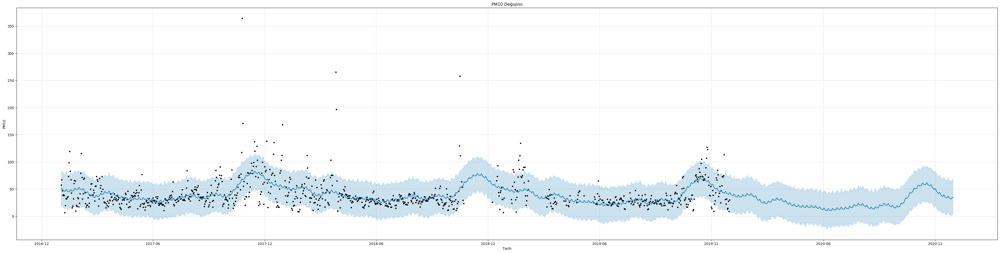

# turkiye-hava-kalitesi-analizi

YMH418 Yazılım Mühendisliği Güncel Konular dersi için yaptığım veri analizi çalışması. 

## Aşama 1 - Veri Toplama

#### Amaç
Bu proje çalışmamdaki amaç tüm Türkiye'yi kapsayan bir veri bilimi çalışması yapmak ve bir il bazında geleceğe yönelik bir tahminde bulunmak.

#### Referans Materyaller

Veri kaynağı olarak "www.havaizleme.gov.tr" kullanılmıştır. 
Proje çalışmasında **Python** dili kullanılmıştır. 
Bazı hesaplamaların ve düzenlemelerin yapılabilmesi için **pandas** ve **numpy** kütüphaneleri kullanılmıştır. 
Grafiklerin çizdirilebilmesi için **seaborn** ve **matplotlib** kütüphaneleri kullanılmıştır. 
Tahminleme modeli olarak **fbprophet** kütüphanesi kullanılmıştır. 
Bazı text düzenleme işlemleri için **Notepad++** Kullanılmıştır.

#### Tanımlar Ve Kısaltmalar

**tr.csv**: İçerisinde 2019 yılında Türkiye'nin 79'iline ait günlük olarak hava verilerinin bulunduğu veri seti. 
**tokat.csv**: İçerisinde Tokat iline ait 2017 ve 2019 yıllarında PM10 değerinin günlük olarak bulunduğu veri seti. 
**hava.py**: Türkiye'nin hava kalitesini incelediğim grafiklerini oluşturduğum python dosyası. 
**fbprophet.py**: Tokat iline ait 2020 yılı için geleceğe yönelik veri tahmininde bununduğum python dosyası. 

**PM10** : Çapı 10 mikrometreden küçük maddeler. 
**SO2** : Kükürt Dioksit Gazı 
**CO** : Karbonmonoksit Gazı 
**NO2** : Azot Dioksit Gazı 
**NOX** : Azot Oksit Gazları 
**NO** : Azot Oksit Gazı 
**O3** : Ozon Gazı 

## Aşama 2 - Verinin Görselleştirilmesi ve Sunumu

İlk olarak veri setimi dataframe olarak okuttum ve baktım.

Dataframeyi detaylı incelemek için info kodunu kullandım.

Verilen bilgilerde toplam 28836 satır ve 9 sutundan oluşan bir veri setimin olduğu ve kolonlardaki boş olmayanlar sayısı ve bu kolonların veri tipleri görünmekte. İlk gözüme çarpan Tarih verisinin object olması.

Toplam boş sayısı da şu şekilde görünmekte.

PM10 ve SO2 değeri haricinde verilerin düzgün tutulmadığı görülmekte. Verilerin yarısından fazlası boş durumda.

Tarih verisi datetime formatına dönüştürüldü.

Sayısal değerler olan verileri de notepad++ aracılığı ile sayı değerleri ondalık ayırmada kullanılan virgülü nokta ile kolon ayırıcı olarak kullanılan noktalı virgülü virgül olarak değiştirdim ve csv olarak kayıt ettim.

Yeni değerler bu şekilde oldu.

Grafikleri gösterirken özelliklerin şehirlere göre dağılımını yaptım. Grafikleri gösterirken en yüksek değerden en düşük değere göre listeleme yaptım.

**PM10** Değerinin 2019 yılında şehirlere göre dağılımı.

Boş değerleri en az olan PM10 değerinde 2019 yılında en yüksek olan 3 şehrimiz Muş, Zonguldak ve Iğdır olmuştur.

**SO2** Değerinin 2019 yılında şehirlere göre dağılımı.

SO2 değerlerinde 2019 yılında en yüksek olan 3 şehrimiz Manisa, Ardahan ve Kahramanmaraş olarak görülmekte.

**CO** Değerinin 2019 yılında şehirlere göre dağılımı.

Veri setimde yüksek boş değere sahip olan CO değeri olarak 2019 yılında en yüksek değere sahip 3 şehir Samsun, Bursa ve Antalya olmuştur.

**NO2** Değerinin 2019 yılında şehirlere göre dağılımı.

NO2 değerlerinde 2019 yılında en yüksek olan 3 şehrimiz Çorum, Kayseri ve Bursa olarak görülmekte.

**NOX** Değerinin 2019 yılında şehirlere göre dağılımı

NOX değerlerinde 2019 yılında en yüksek olan 3 şehrimiz Çorum, Bursa ve Kayseri olarak görülmekte.

**O3** Değerinin 2019 yılında şehirlere göre dağılımı.

O3 değerlerinde 2019 yılında en yüksek olan 3 şehrimiz Hatay, Bilecik ve Isparta olarak görülmekte.

## Aşama 3 - Verinin Karakteristiklerinin Analizi

İlk olarak ele alacağım özellikler hakkında detaylı bilgi edinelim. Bu özelliklerin artıp azalmasına neyin sebep olduğunu ve değerlerin insan sağlığı için önemini aşağıya yazdım.

**PM10** = Partiküler Madde (PM10) ve çapı 10 mikrometreden küçük diğer tanecikler akciğerlere ulaşarak iltihaplanmaya ya da insanları çok olumsuz etkileyecek kalp ve akciğer hastalıklarına neden olabilirler. Oluşma sebeplerinden biri katı yakıtların içeride ve açık mahallerde veya geleneksel sobalarda yakılması sonucudur.

**SO2** = Kükürt dioksit (SO2) insanlar için doğrudan zehirleyicidir; temel olarak solunum fonksiyonlarını etkiler. Sülfürik asit ve sülfat formuna dönüşmesi durumunda insan sağlığını dolaylı olarak tehdit edebilir. Şeker endüstrisinde kullanılır. Renksiz, keskin kokulu reaktif bir gaz olan kükürt dioksit; kömür, fuel-oil gibi kükürt içeren yakıtların yanması sırasında, metal eritme işlemleri ve diğer endüstriyel işlemler sonucu oluşur. Hava kirliliği ve asit yağmurlarına neden olur.

**CO** = Karbonmonoksit, bir karbon ve bir oksijen atomundan oluşan inorganik molekülün adı. Hidrokarbonların eksik yanmalarının ürünüdür. CO oluşumunda 3 temel neden vardır:
  - Yakıt ve oksijenin yetersiz karışımı,
  - Oksijen eksikliği,
  - Alıkonma süresinin çok kısa olması.

**NO2** = Azot dioksit, NO₂, kırmızımsı kahve renkli ve zehirli bir gazdır. Keskin bir kokuya sahip olan bu gazın kokusu klor gazına benzemektedir. NO2 fosil yakıtlarının, yani Gaz, Kömür ve Yağ'ların yanması sonucunda ortaya çıkmaktadır. Böylelikle araçların atık gazlarında ve ısınmak için kullanılan gaz ve kömürün yanmasıyla bol miktarda bu gazdan doğaya salınmaktadır.

**NOX** = Azot oksitlerin ana kaynağı motorlu araçlar ve enerji üretim istasyonlarıdır. Doğal kaynaklarından birisi topraktaki organik çürümelerdir. NOx’un doğal kaynakları arasında orman yangınları, yıldırım ve topraktaki mikrobiyolojik işlemler vardır.

**NO** = Azot monoksit, kimyasal formülü NO olan bir bileşiktir. Bu gaz, -insanlar da dâhil olmak üzere memelilerin vücutlarında önemli bir sinyal molekülü olmasının yanı sıra kimyasal endüstride de önemli bir ara üründür. Ayrıca NO, araba motorları ve elektrik santralleri tarafından üretilerek hava kirliliğine neden olur.

**O3** = Üç oksijen atomundan oluşan molekülleriyle Zehirli, renksiz bir gaz. Sıvı halde lacivert rengini alır. Atmosferin üst katmanlarında yer alan ozon, dünyayı güneşten gelen morötesi radyasyona karşı korur. Ozon çok tehlikeli bir maddedir. Yeryüzünde ise gözleri, burnu ve boğazı tahriş eden ozon, solunum sistemini tahrip eder. Güneş ışığında fotokimyasal tepkimeye giren egzoz gazları, kirli havadan oluşan duman bulutlarında ozon ve nitrojen dioksit bulunur.

Özelliklerin ne olduğunu bu özelliklerin oluşmasına neyin sebep olduğunu genel olarak öğrendikten sonra ilk olarak bu özelliklerin bir birleri ile herhangi bir ilişkisi var mı yok mu bakmak için bir dağılım grafiği çizdirdim.

Dağılım grafiğinde ilk olarak dikkatleri çeken ayrıntı NOX-NO özelliklerinin birbirine pozitif bir korelasyon ile bağlı olduğudur. Bu değerlerin yakın olmasının nedeni kaynaklarının neredeyse aynı olmasına bağlayabiliriz. İkinci bir çıkarımda PM10 değerinin diğer hiçbir özellikle pek bağlantısının olmaması olabilir. PM10 özelliği sadece CO özelliği ile kısmen pozitif korelasyona sahiptir. Üçüncü çıkarım ise NOX-NO2 ve özellikleridir bu özelliklerde pozitif bir korelasyona sahiptir. Bu pozitif korelasyonun sebebini de kaynaklarının neredeyse aynı olmasına bağlayabiliriz. 

Daha sonra korelasyon matrisi çizdirdim.

Korelasyon matrisinde de dağılım grafiğinden çıkardığımız sonuçları destekleyen oranlar görülmekte. NO ve NOX değerleri 0.93, NO2 ve NOX değerleri ise 0.83 olarak verilmiştir.

Daha sonra özelliklerin aylara göre değişim oranına bakmak için ısı haritası çizdirmek istedim ancak aylar için bir özelliğim bulunmuyordu ve ay için bir kolon oluşturup ay özelliği ekledim. Ve her özellik için Şehrin aya göre olan değişim miktarlarının ısı haritasını çizdirdim.

**PM10** değeri için Şehir ve Aylara göre ısı haritası dağılımı:

PM10 değerleri için Şehir ve Aylara göre ısı dağılımı haritasına baktığımızda ilk göze çarpan Iğdır ve Muş’taki değerlerin diğer illere göre fazla olduğunu görüyoruz. Diğer detay ise 11 ay yani Kasım aylarında bu değerin bir artışta olduğu görülmekte.

**SO2** değeri için Şehir ve Aya göre ısı haritası dağılımı:

SO2 değerleri için Şehir ve Aylara göre ısı dağılımı haritasına baktığımızda Iğdır’da 2019 yılı için ilk on ay boyunca tutulmadığını görüyoruz. Hakkâri, Manisa ve Şanlıurfa’da bu değerin belirli dönemlerde şiddetli bir şekilde dalgalandığı görülmekte. Bazı diğer illerde de bu dalgalanma görülebiliyor ancak bu üç il kadar olmadığı görülüyor. Ardahan’da yıl içerisinde bu değerin genele oranla neredeyse iki kat daha fazla olduğu görülmekte.

**CO** değeri için Şehir ve Aya göre ısı haritası dağılımı: 

CO değerleri için Şehir ve Aylara göre ısı dağılımı haritasına baktığımızda PM10 değeri gibi yılın belirli dönemlerinde artış gösterdiği görülüyor. Bu değerin Ekim ve Kasım aylarında artışta olduğu görülüyor.

**NO2** değeri için Şehir ve Aya göre ısı haritası dağılımı:

NO2 değerleri için Şehir ve Aylara göre ısı dağılımı haritasına baktığımızda 2019 yılı içerisinde genel olarak değeri yüksek olan iller Bursa, Kayseri ve Çorum olduğu görülmekte. Ankara, Antalya, Isparta, Kocaeli ve Konya’nın değerlerinin de nispeten yüksek olduğu görülmekte.

**NOX** değeri için Şehir ve Aya göre ısı haritası
dağılımı:

NOX değerleri için Şehir ve Aylara göre ısı dağılımı haritasına baktığımızda NO2 değeri gibi Bursa, Kayseri ve Çorum’un değerlerinin yüksek olduğu görülüyor. NOX değerinin genel olarak Ekim, Kasım ve Aralık aylarında arttığı görülmekte.

**NO** değeri için Şehir ve Aya göre ısı haritası dağılımı:

NO değerleri için Şehir ve Aylara göre ısı dağılımı haritasına baktığımızda Bursa, Kayseri ve Konya’da değerlerin bazı dönemlerde çok yüksek olduğu görülmekte. Yine bu değerin de Ekim, Kasım ve Aralık aylarında artış gösterdiği görülmekte.

**O3** değeri için Şehir ve Aya göre ısı haritası dağılımı:

O3 değerleri için Şehir ve Aylara göre ısı dağılımı haritasına baktığımızda değer aralığının küçük olmasından kaynaklı O3 değerinin çok şiddetli olduğu görülmekte. Ancak en yüksek değerlere sahip illerin Bilecik, Hatay ve Karaman olduğu görülmekte

## Aşama 4 - Model Kurma

Facebook tarafından geliştirilen **fbprophet** modelini kullanarak modeli kurup tahminleme yaptım. Bu modelin güçlü yanlarından biri eksik verilere karşı da dayanıklı olmasıdır. Bende verisetimin boşluklarını önceden haftalık ortalamaya göre dolduruyordum ancak bu model bu işlemi otomatik olarak düzenliyor. Kurduğum modelde trend esnekliğini varsayılan değer olan 0.05 olarak ayarladım. Günlük verilerle çalıştığım için de freq değerini “D” olarak belirledim. 

## Aşama 5 - Geleceğe Yönelik Veri Tahmini

İlk olarak verisetimi ham olarak görselleştirdim ve bu sayede PM10 değerlerine genel bir göz atabiliyoruz.

2017.01.02 - 2019.12.31 tarihine kadar olan tüm verilerimiz görüntüleniyor. Çizilmeyen bazı küçük kesitlerse PM10 değeri bilinmeyen tarihlerdir.

Diğer görselimse 365 günlük olarak fbprophet modeli kullanarak yaptığım tahmine ait görsel.

Görselde bulunan noktalar değişim(change point) zamanlarıdır. Bu değerler PM10 değerinin ani değişim geçirdiği zamanlardır. Tahmin ve geçmiş değerlere baktığımızda PM10 Değerinin genel bir azalış eğiliminde olduğu görülmektedir. Buradan PM10 değerini düşürme çalışmalarının düşük bir oranda da olsa başarılı olduğunu veya yapılan çalışmaların PM10 değerini etkilemediği sonucuna ulaşabiliriz.

Diğer görselimse tahmin verilerine ait eğilim, haftalık ve yıllık olarak eğilimlerin sonuçlarını göstermekte.

İlk grafiğe(trend) baktığımızda eğilimin 2017 yılının sonlarında zirveye ulaşıp daha sonra eğilimin aşağı doğru indiğini görüyoruz.

İkinci grafiğe(weekly) baktığımızda PM10 değerinin haftanın hangi günlerinde artış ve azalış gösterdiğini görebiliyoruz. Pazar günleri artmaya başlayan değer Salı gününe kadar artışını devam ettirip sonra Cuma gününe kadar düşüş gerçekleştirmiş. Buradan PM10 değerinin artış sebebinin çalışma zamanlarına bağlayabiliriz.

Üçüncü grafiğe(yearly) baktığımızda yaz aylarında düşen eğilim sonbahar ve kış aylarında artış gösterdiği görülüyor. Bunu etkileyen faktörlerse havaların soğumasına bağlı olarak artak katı yakıt tüketimi olarak değerlendirebiliriz.

#### Katkı İçin

	1. Forkla (https://github.com/furkanatesli/turkiye-hava-kalitesi-analizi/fork)
	2. Yeni özellik dalını oluştur (`git checkout -b [dal_adi]`)
	3. Değişiklikleri ekleyin (`git commit -am 'yenilikler eklendi'`)
	4. Dalı gönderin (`git push origin [dal_adi]`)
	5. Yeni bir Pull Request isteği oluşturun
